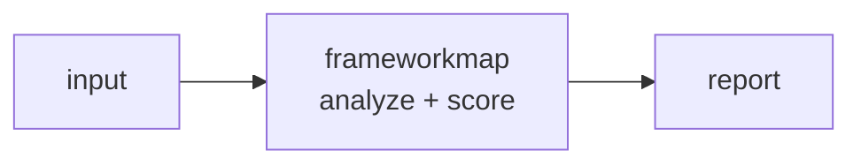

<a name="top"></a>
<div align="center">


# FRAMEWORKMAP

### Crosswalk controls across NIST, ISO 27001, SOC 2, CMMC, PCI


[](https://pypi.org/project/cognis-frameworkmap/) [](https://github.com/cognis-digital/frameworkmap/actions) [](LICENSE) [](https://github.com/cognis-digital)

*Compliance & GRC — get audit-ready and stay there, self-hosted.*

</div>

```bash
pip install cognis-frameworkmap
frameworkmap map AC-2          # → one control mapped across every framework
```

## Usage — step by step

1. **Install** the CLI:

   ```bash
   pipx install "git+https://github.com/cognis-digital/frameworkmap.git"
   ```

2. **List** what you can crosswalk, then map a single control to every other framework (primary command):

   ```bash
   frameworkmap frameworks            # supported frameworks
   frameworkmap map AC-2              # one control -> all frameworks
   ```

3. **Crosswalk** two specific frameworks, or measure how much of one is covered by another:

   ```bash
   frameworkmap crosswalk nist iso27001
   frameworkmap coverage nist soc2
   frameworkmap gaps nist cmmc        # source controls with no target match
   ```

4. **Read the output** in the format your workflow speaks — `table` (default),
   `json`, `csv`, or `md` (Markdown table for audit reports) — or swap in your
   own control catalog:

   ```bash
   frameworkmap --format json crosswalk nist pci > crosswalk.json
   frameworkmap --format csv  crosswalk nist iso27001 > crosswalk.csv   # spreadsheet
   frameworkmap --format md   crosswalk nist iso27001                   # paste into a report
   frameworkmap --catalog my-catalog.json coverage nist iso27001
   ```

5. **Automate in CI** — fail an audit-readiness check when coverage drops:

   ```bash
   frameworkmap --format json coverage nist soc2 | jq -e '.coverage_pct >= 90'
   ```

## Contents

- [Why frameworkmap?](#why) · [Features](#features) · [Quick start](#quick-start) · [Example](#example) · [Architecture](#architecture) · [AI stack](#ai-stack) · [How it compares](#how-it-compares) · [Integrations](#integrations) · [Install anywhere](#install-anywhere) · [Related](#related) · [Contributing](#contributing)

<a name="why"></a>
## Why frameworkmap?

auto-mapping is the killer GRC feature

`frameworkmap` is single-purpose, scriptable, and self-hostable: map a control or a whole framework, get results in the format your workflow already speaks (table · JSON · CSV · Markdown), gate CI on coverage, and let agents drive it over MCP.

<div align="right"><a href="#top">↑ back to top</a></div>

<a name="features"></a>
## Features

- ✅ Load Catalog
- ✅ Map Control
- ✅ Crosswalk Framework
- ✅ Coverage Report
- ✅ Find Gaps
- ✅ Export to table · JSON · CSV · Markdown (audit working papers)
- ✅ Runs on Linux/macOS/Windows · Docker · devcontainer
- ✅ Ports in Python, JavaScript, Go, and Rust (`ports/`)

<div align="right"><a href="#top">↑ back to top</a></div>

<a name="quick-start"></a>
## Quick start

```bash
pip install cognis-frameworkmap
frameworkmap --version
frameworkmap map AC-2                      # one control -> all frameworks
frameworkmap coverage nist iso27001        # how much of NIST maps onto ISO 27001
frameworkmap gaps nist pci                 # NIST controls with no PCI equivalent
frameworkmap --format csv crosswalk nist iso27001 > crosswalk.csv   # audit export
```

<div align="right"><a href="#top">↑ back to top</a></div>

<a name="example"></a>
## Example

```text
$ frameworkmap map AC-2
NIST AC-2  Account Management
objectives: AC, IA
  ISO27001  A.5.15         Access control  [via AC]
  SOC2      CC6.1          Logical access security controls  [via AC]
  CMMC      AC.L2-3.1.1    Limit system access to authorized users  [via AC]
  PCI       7.2            Restrict access by business need to know  [via AC]
  PCI       8.3            Strong authentication for users  [via IA]

$ frameworkmap coverage NIST PCI
NIST -> PCI
  controls : 15
  covered  : 13
  gaps     : 2
  coverage : 86.7%
```

### Demos

Realistic, runnable scenarios live in [`demos/`](demos/) — each has a
`SCENARIO.md` with the persona, exact commands, expected output, and how to act:

| Demo | Scenario |
|---|---|
| [`01-basic`](demos/01-basic/) | Auto-map one NIST control across the whole GRC stack |
| [`02-soc2-to-iso-readiness`](demos/02-soc2-to-iso-readiness/) | SOC 2 shop pursuing ISO 27001 — readiness + net-new gaps |
| [`03-pci-gap-assessment`](demos/03-pci-gap-assessment/) | PCI DSS v4.0 merchant cross-referencing NIST 800-53 |
| [`04-cmmc-defense-contractor`](demos/04-cmmc-defense-contractor/) | DIB contractor: NIST program → CMMC 2.0 Level 2 |
| [`05-custom-catalog-startup`](demos/05-custom-catalog-startup/) | Bring-your-own catalog for an *honest* startup coverage number |
| [`06-audit-export-csv`](demos/06-audit-export-csv/) | Export a crosswalk to CSV / Markdown for the working paper |
| [`07-coverage-ci-gate`](demos/07-coverage-ci-gate/) | Fail CI when audit-readiness coverage drops below a threshold |
| [`08-multi-framework-matrix`](demos/08-multi-framework-matrix/) | One-glance coverage matrix across all five frameworks |
| [`09-objective-spine`](demos/09-objective-spine/) | Why two controls "match" — trace every mapping to its objective |

<div align="right"><a href="#top">↑ back to top</a></div>

<a name="architecture"></a>
## Architecture



<div align="right"><a href="#top">↑ back to top</a></div>

<a name="ai-stack"></a>
## Use it from any AI stack

`frameworkmap` is interoperable with every popular way of using AI:

- **MCP server** — `frameworkmap mcp` (Claude Desktop, Cursor, Cognis.Studio, [uncensored-fleet](https://github.com/cognis-digital/uncensored-fleet))
- **OpenAI-compatible / JSON** — pipe `frameworkmap --format json crosswalk nist iso27001` into any agent or LLM
- **LangChain · CrewAI · AutoGen · LlamaIndex** — wrap the CLI/JSON as a tool in one line
- **CI / scripts** — exit codes + JSON/CSV for non-AI pipelines

<div align="right"><a href="#top">↑ back to top</a></div>

<a name="how-it-compares"></a>
## How it compares

| | **Cognis frameworkmap** | CISO Assistant |
|---|:---:|:---:|
| Self-hostable, no account | ✅ | varies |
| Single command, zero config | ✅ | ⚠️ |
| JSON + CSV + Markdown export | ✅ | varies |
| MCP-native (AI agents) | ✅ | ❌ |
| Polyglot ports (JS/Go/Rust) | ✅ | ❌ |
| Open license | ✅ COCL | varies |

*Built in the spirit of **CISO Assistant**, re-framed the Cognis way. Missing a credit? Open a PR.*

<div align="right"><a href="#top">↑ back to top</a></div>

<a name="integrations"></a>
## Integrations

Pipes into your stack: **CSV/Markdown** for audit working papers and spreadsheets, **JSON** for anything, an **MCP server** (`frameworkmap mcp`) for AI agents, and a webhook forwarder for SIEM/Slack/Jira. See [`docs/INTEGRATIONS.md`](docs/INTEGRATIONS.md).

<div align="right"><a href="#top">↑ back to top</a></div>

<a name="install-anywhere"></a>
## Install — every way, every platform

```bash
pip install "git+https://github.com/cognis-digital/frameworkmap.git"    # pip (works today)
pipx install "git+https://github.com/cognis-digital/frameworkmap.git"   # isolated CLI
uv tool install "git+https://github.com/cognis-digital/frameworkmap.git" # uv
pip install cognis-frameworkmap                                          # PyPI (when published)
docker run --rm ghcr.io/cognis-digital/frameworkmap:latest --help        # Docker
brew install cognis-digital/tap/frameworkmap                             # Homebrew tap
curl -fsSL https://raw.githubusercontent.com/cognis-digital/frameworkmap/main/install.sh | sh
```

| Linux | macOS | Windows | Docker | Cloud |
|---|---|---|---|---|
| `scripts/setup-linux.sh` | `scripts/setup-macos.sh` | `scripts/setup-windows.ps1` | `docker run ghcr.io/cognis-digital/frameworkmap` | [DEPLOY.md](docs/DEPLOY.md) (AWS/Azure/GCP/k8s) |

<div align="right"><a href="#top">↑ back to top</a></div>

<a name="related"></a>
## Related Cognis tools

- [`soc2box`](https://github.com/cognis-digital/soc2box) — SOC 2 evidence collector and control tracker, self-hosted
- [`gdprkit`](https://github.com/cognis-digital/gdprkit) — GDPR/CCPA DSAR, RoPA, and cookie-consent toolkit
- [`policyforge`](https://github.com/cognis-digital/policyforge) — Auto-generate security policies from a short questionnaire
- [`vendorvet`](https://github.com/cognis-digital/vendorvet) — Third-party / vendor risk questionnaires with SBOM cross-ref
- [`auditrail`](https://github.com/cognis-digital/auditrail) — Tamper-evident audit-log aggregator with hash-chained attestation
- [`dpiaforge`](https://github.com/cognis-digital/dpiaforge) — DPIA and EU AI Act impact-assessment generator

**Explore the suite →** [🗂️ all 170+ tools](https://github.com/cognis-digital/cognis-neural-suite) · [⭐ awesome-cognis](https://github.com/cognis-digital/awesome-cognis) · [🔗 cognis-sources](https://github.com/cognis-digital/cognis-sources) · [🤖 uncensored-fleet](https://github.com/cognis-digital/uncensored-fleet) · [🧠 engram](https://github.com/cognis-digital/engram)

<div align="right"><a href="#top">↑ back to top</a></div>

<a name="contributing"></a>
## Contributing

PRs, new rules, and demo scenarios are welcome under the collaboration-pull model — see [CONTRIBUTING.md](CONTRIBUTING.md) and [SECURITY.md](SECURITY.md).

> ### ⭐ If `frameworkmap` saved you time, **star it** — it genuinely helps others find it.

## Interoperability

`{}` composes with the 300+ tool Cognis suite — JSON in/out and a shared
OpenAI-compatible `/v1` backbone. See **[INTEROP.md](INTEROP.md)** for the
suite map, composition patterns, and reference stacks.

## License

Source-available under the **Cognis Open Collaboration License (COCL) v1.0** — free for personal, internal-evaluation, research, and educational use; **commercial / production use requires a license** (licensing@cognis.digital). See [LICENSE](LICENSE).

---

<div align="center"><sub><b><a href="https://cognis.digital">Cognis Digital</a></b> · one of 170+ tools in the <a href="https://github.com/cognis-digital/cognis-neural-suite">Cognis Neural Suite</a> · <i>Making Tomorrow Better Today</i></sub></div>
